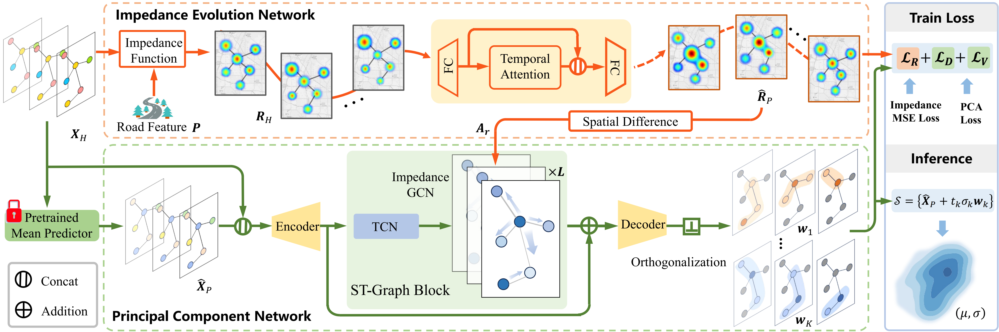

# RIPCN: A Road Impedance Principal Component Network for Probabilistic Traffic Flow Forecasting

This repository contains the official implementation of the RIPCN model for probabilistic traffic flow prediction tasks.

## Overview

RIPCN is a probabilistic traffic flow forecasting framework that integrates transportation theory and spatiotemporal principal component learning. By modeling dynamic road impedance and learning the main directions of uncertainty, RIPCN provides both reliable point predictions and accurate uncertainty estimates. 

## Key Features

- **All-in-One Pipeline**: The data preparation, model training, metric calculation, and evaluation are fully integrated. There is no need for users to run separate scripts for dataset construction or independent metric computation — everything is handled within the unified pipeline (see [`main.py`](main.py)).
- **Spatiotemporal Modeling**: Efficiently extracts temporal and spatial features using principal component approaches and graph-based structures.

## Model Architecture



## Getting Started

### 1. Running the Pipeline

With the integrated pipeline, you can train, evaluate, and generate all necessary outputs simply by running:

```bash
python main.py
```

You can adjust key parameters via command-line arguments, for example:

```bash
python main.py --data PEMS08 --T_h 12 --T_p 12 --batch_size 32 --epoch 200 --cuda 0
```

Refer to `main.py` for the full list of arguments. The following parameters are especially important:

- `--train_mean`: Whether to train the mean predictor. You may change the mean predictor if needed. If data files constructed by a different mean predictor are already available, you may set this to `False` to skip mean predictor training.
- `--train_nppc`: Whether to train the RIPCN model.
- `--load_nppc`: Whether to load a pre-trained RIPCN model.

Other useful arguments include:
- `--data`: Dataset name (default: PEMS08)
- `--T_h`: History window size (default: 12)
- `--T_p`: Prediction window size (default: 12)
- `--batch_size`: Batch size (default: 12)
- `--epoch`: Number of training epochs (default: 200)
- `--cuda`: GPU device index (default: 1)
- ...and additional options.
  
Please see `main.py` for further customization.

### 2. Results and Outputs

All models, logs, forecasts, and metrics are automatically saved under respective `output_*/` subdirectories:
- `output_*/model/` &nbsp;→ Model checkpoints
- `output_*/log/` &nbsp;→ Training logs
- `output_*/forecast/` &nbsp;→ Forecast results


## Notes

- The entire workflow—data construction, metric calculation, evaluation—is unified in the main pipeline; no manual or separate steps are required.
- The codebase is actively evolving and improving.
- Details about the RIPCN methodology will be available in our upcoming publication.
- Example data is in the directory.

**Dataset Download**  
The traffic datasets used in this project are accessible at the following sources (registration and agreement to terms may be required):

- PEMS03, PEMS04, PEMS08 (California PEMS). 
Official PEMS data access: [https://pems.dot.ca.gov/](https://pems.dot.ca.gov/)  

- Seattle. Download links and details: [https://github.com/zhiyongc/Seattle-Loop-Data](https://github.com/zhiyongc/Seattle-Loop-Data)

Pre-processed datasets and additional details can be found at: [https://handle.test.datacite.org/10.5072/zenodo.472877](https://handle.test.datacite.org/10.5072/zenodo.472877)  

For dataset schema and variable details, see [`data/dataset/Data_Description.md`](./data/dataset/Data_Description.md).